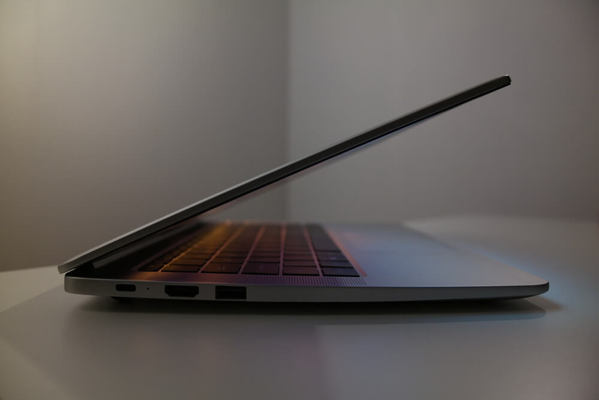
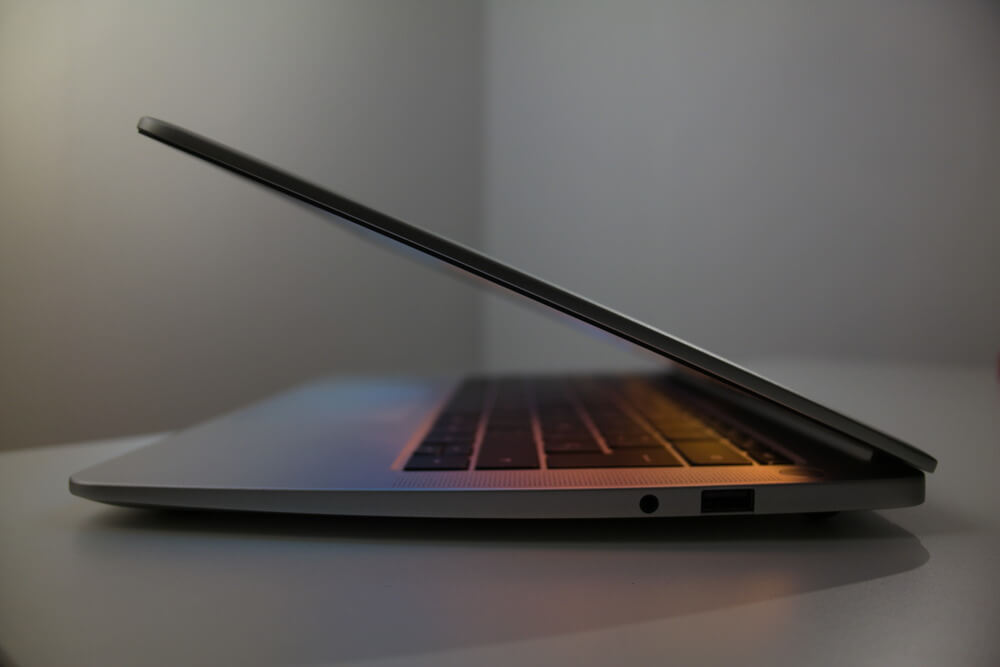
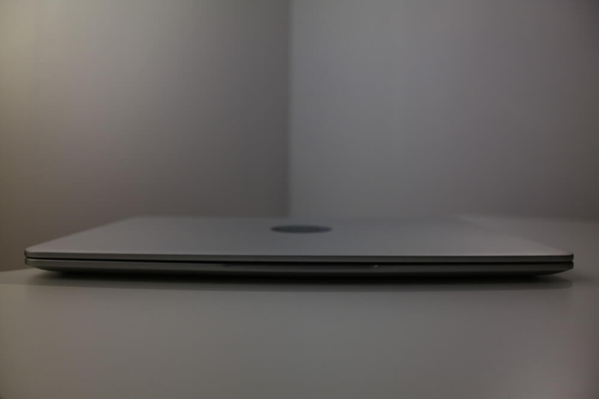
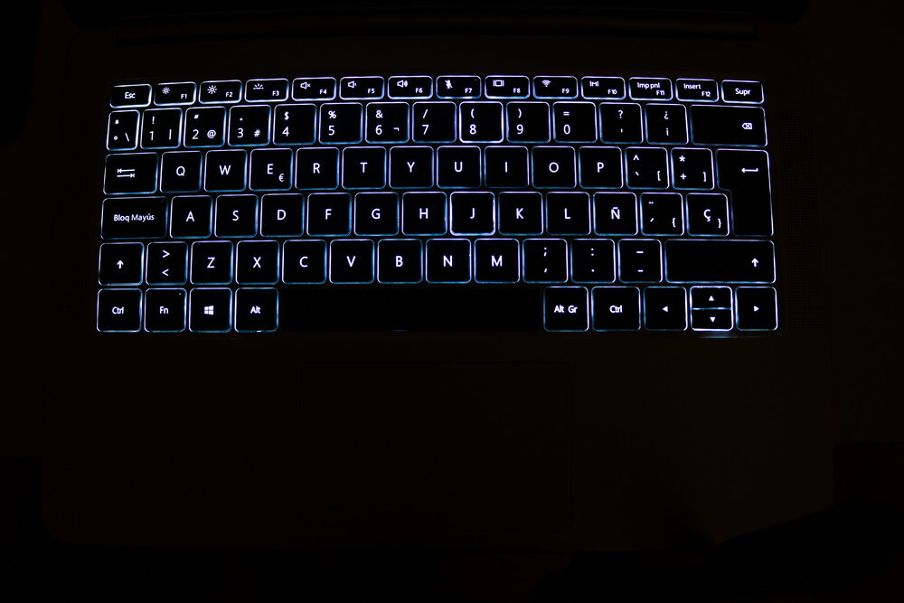
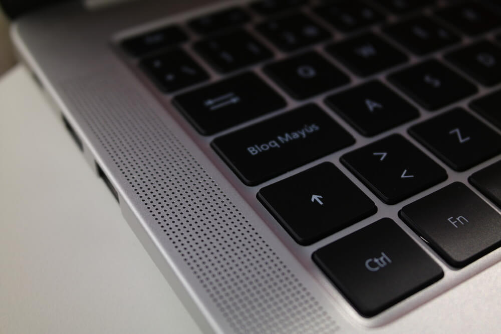
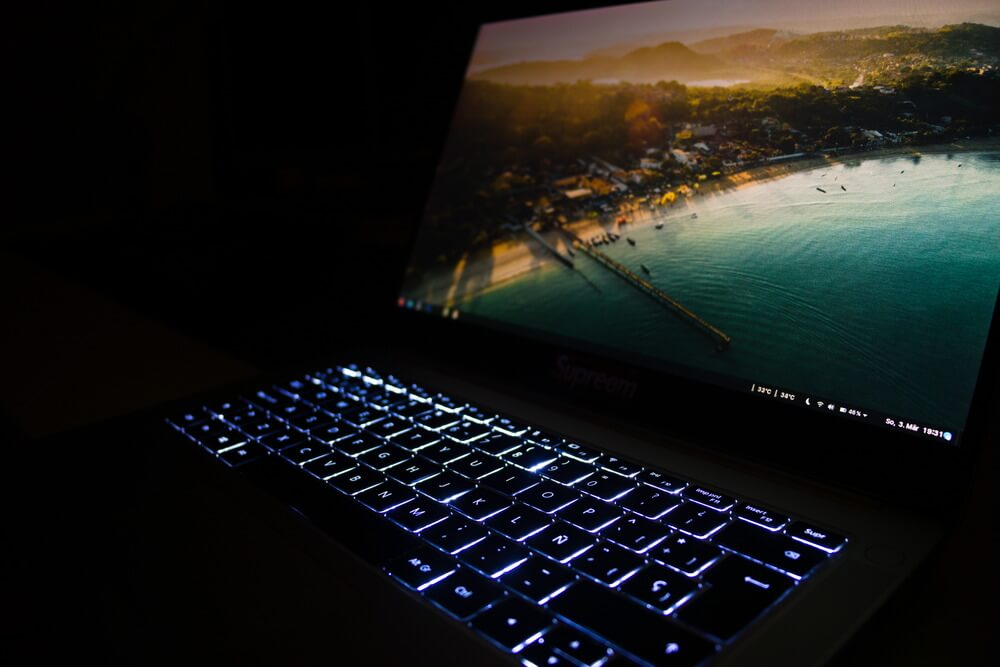

For a pretty long time, I've been looking for a new mobile companion when being on the go. After weeks of considering many different laptops, I finally made a decision and bought a Huawei Matebook D for around 600€ (~\$680). Considering the rather low price for what Huawei claims to offer here, can it actually deliver?

<!-- more -->

### Specs and Overview

This model of the Matebook D series ships with an AMD Ryzen 5 2500U, without a dedicated GPU but a fairly competent Vega 8 mobile integrated graphics chip, 8 GB of DDR4 memory and a 256GB SATA SSD. The bottom of the case can be quite easily opened to upgrade the SATA SSD to an NVM.e one, as the M.2 slot is actually PCIe capable - the RAM is soldered, unfortunately.

On the other side, you'll get another USB-A, but this one only support USB 2.0 - the inclusion of this ancient port feels a little off. A microphone-headphone combo-jack is also present. Unlike other models, this one does not feature a fingerprint sensor in the power button.

The included power adapter fits well with the laptop's design - it is small and just as sleek as the device it's charging. Unfortunately, it is not as rigid as appears on first glance and touch. I [dropped](https://gfycat.com/SlipperyIllfatedAmericanratsnake) it from a rather low height, yet it still added an unappealing-looking dented corner.

### Design

The design of this laptop is simply put gorgeous and one of the highlights of the device. I'd be lying if I said the looks of this laptop didn't play a role in the purchasing decision. It is not completely flawless though - most notably, the plastic-topped and -surrounded screen, which is very prone for highlighting fingerprints, is not a welcome addition to the otherwise marvelous chassis. Furthermore, I'm not a huge fan of the slant - while it makes the device look thinner from the front, it is not a linear gradient, as the angled part starts after the I/O. The non-unibody design is also noticable, especially around the ports, as is the slightly dentable screen chassis. While it might sound nitpicky, the icon on the Shift key has a thicker stroke than any of the other icons making it look a little misplaced.

### Display

With its small side-bezels, the anti-glare Full HD IPS panel looks remarkable. The viewing angles are great, colors and contrast are decent and it gets fairly bright at day use and dark at night use. I can't test the accuracy but I doubt it's super accurate. Personally, I find the 14" size to be the perfect middle point between heavy 15" and tiny 13" - all in all, I like the display.

### Performance

I was quite interested what the performance of the CPU would look like, as AMD was absent from the mid- to highend (mobile) CPU market for quite some time now. In [Geekbench](https://browser.geekbench.com/v4/cpu/12023808), I scored a 4022 in the single-core and a 9847 in the multi-core benchmarks. Compared to other Ryzen 2500U equipped devices, such as the [HP Pavillion 15](https://browser.geekbench.com/v4/cpu/12622492), it's about on par. In contrast to the popular i5 8250U, that is found in most laptops in this price league, the Intel chip notably takes the crown, but it also has an inferior integrated GPU.

### Cooling

At idle, the machine is completely quiet as the fan does not engage and the CPU sits at a comfortable 40° C. Under moderate load, things can get quite noisy. The fan unnecessarily ramps up to a way to high level during short bursts of loads, like building an AUR package, which is annoying, especially since the temperatures don't even rise to a level where this engagement of the fan would be required. It sometimes is also perceptible when the device is charging - again, temps stay reasonable, yet the fan still engages. The lackluster BIOS straight out of 2003 unfortunately doesn't give you control about the fan curves.

### Keyboard and Touchpad

You could argue that the design is somewhat inspired by Apple products - unfortunately, they also applied this inspiration to the keyboard. It is at least not as low-travel as the ones found in the newer MacBooks, but sits somewhat in between average low-profile keys and the ultra low-profile Butterfly switches. It does take a little time to get used to, but after that it probably won't bother you much. The backlight, that offers three steps of brightness (off, medium, on), makes using it in the dark a lot more easy.

The touchpad isn't unusable either. While I do wish it was slightly bigger, the tactile click feels satisfying, it ships with Windows Precision Drivers and also has exceptional tracking using Linux, gestures work perfectly - overall, it feels really solid. It also does take some training time because of its position that is not relative to the space bar but rather centered relative to the entire device, which is off-putting at first. Strangely enough, the left, right and topmost millimeter of the touchpad do not react to inputs while the bottom edge does. All in all though, it holds up reliably.

### Speakers and Webcam

Surprisingly enough, the speakers sound quite decent for a chassis this thin. They get reasonably loud and the sound even has a touch bass to it. Though, the sound gets slightly distorted at high volumes and the speakers are for some reason downwards-firing, even though there are speaker grills besides the keyboard. The webcam is frankly unexceptional - it is only 480p (another Apple thing they shouldn't have copied), shoots in 4:3 for some reason and the dynamic range is so abysmal, that not even the notably good microphone can save this mess. If you are doing a lot of video calls, this is probably not the machine for you.

### Battery Life

Battery life is average - when using the laptop under moderate load, you can reach six hours comfortably, maybe even six and a half. Under full load, I wouldn't trust it more than 2 hours. It quickly charges back up again though - usually, it only takes around 90 minutes.

### Linux Experience

I'm using Arch Linux with GNOME, which works flawlessly with only some modifications needed. The touchpad required some tweaking in the `libinput` config to get gestures working and deep sleeping also needed some configuration. Only the USB-C port is a bit flaky, as it does not output a display link to a monitor, which does work under Windows. Also, the PC Manager software responsible for updating your BIOS is unavailable under Linux. The binary BIOS files are offered by Huawei's support page, so if you have big balls and a steady hand for a potential soldering job, you might be able to manually flash the mainboard using a tool like [BiosDisk](https://wiki.archlinux.org/index.php/Flashing_BIOS_from_Linux#BiosDisk).

### Bottom Line

For 600€ and sometimes even less than that, I find you are getting such great value for your money here, that not even the Intel-based laptops from Xiaomi can beat. Personally, I find the balance between design, performance and price bang-on, making it an awesome deal.
